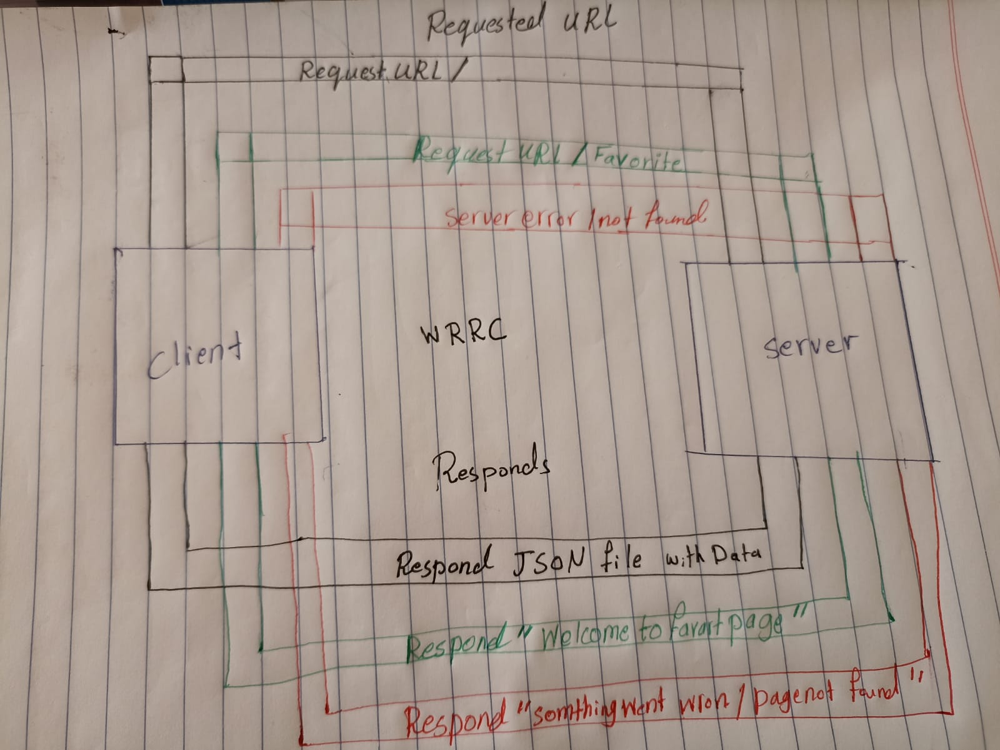
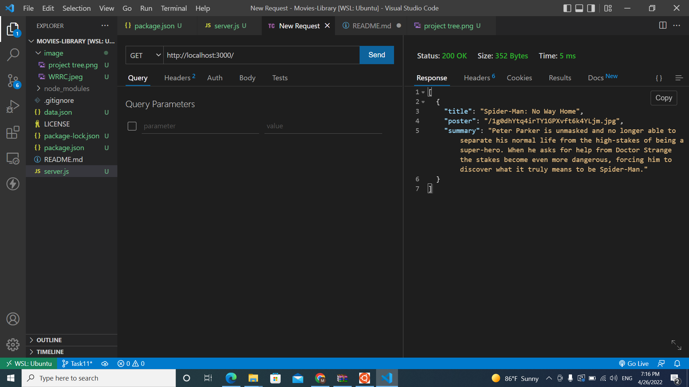
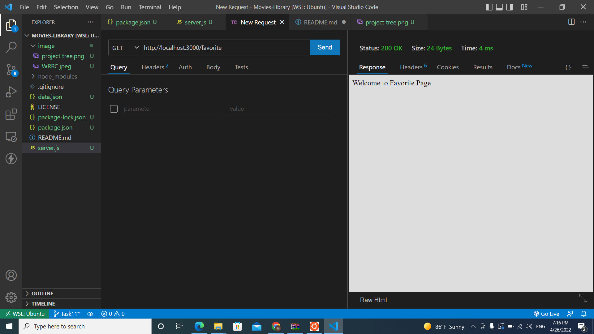
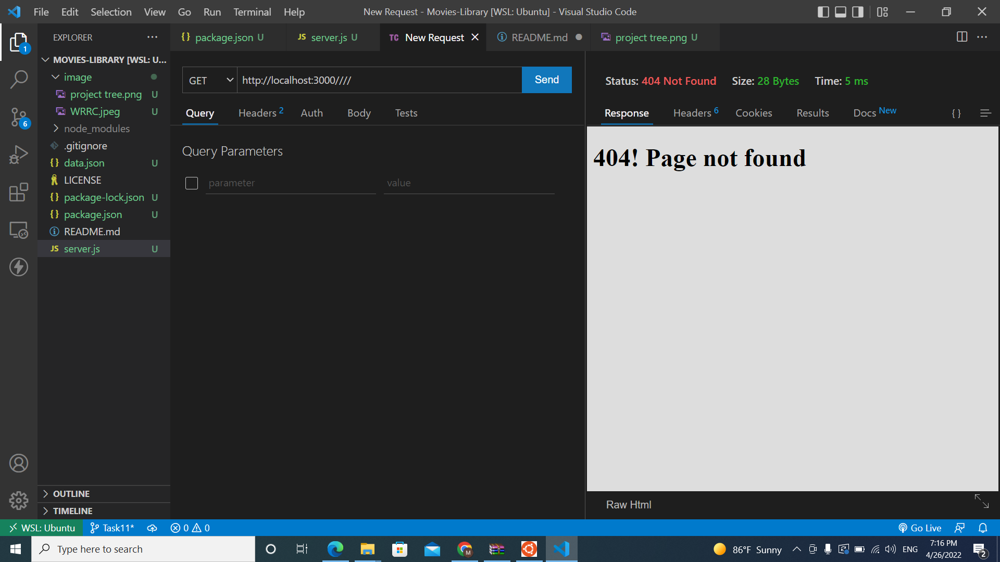

# Movies-Library
# Project Name - Project Version

**Author Name**: Murad jamal Alazzeh

## Overview
 as a start we learn how to build basic server that request a URL and a method like get ,delete ,post 
 our server should respond with a data or status 

## Getting Started
* first i need to run my Javascript out side the browser so we used node JS as run time envinroment 
* we used node to run the server 
* we used frame work : Express JS as simple way to start with the sarver 
* then we start to do node package manager initialization
* then we used the listting commande on spacific port  

* we learn to sendback data using JSON data 

## WRRC
***This a hand draw WRRC***

***This the project files***

## Project Features
