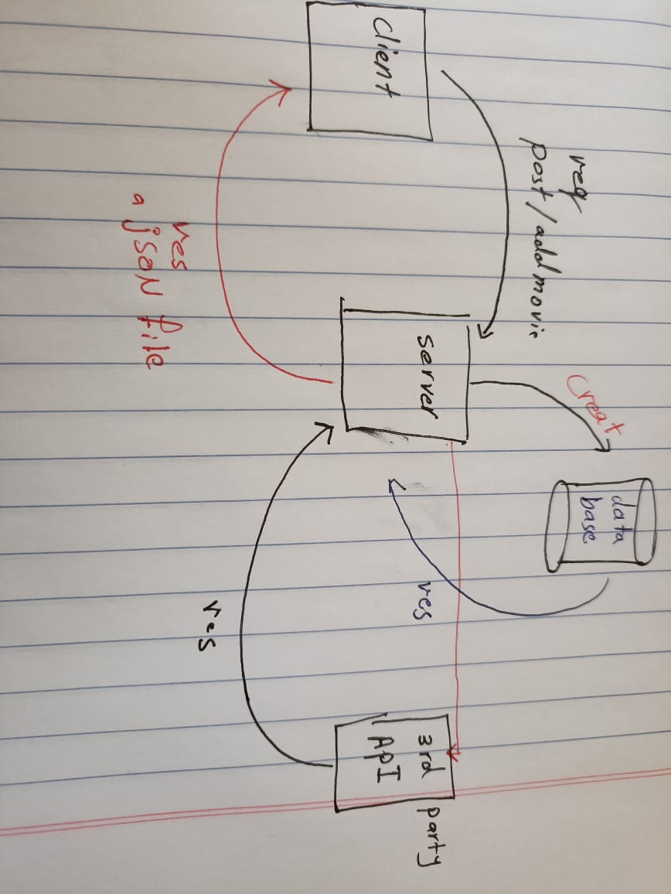

# Movies-Library
# Project Name - Project Version

**Author Name**: Murad jamal Alazzeh

## Overview
 as a start we learn how to build basic server that request a URL and a method like get ,delete ,post 
 our server should respond with a data or status 

## Getting Started
* first i need to run my Javascript out side the browser so we used node JS as run time envinroment 
* we used node to run the server 
* we used frame work : Express JS as simple way to start with the sarver 
* then we start to do node package manager initialization
* then we used the listening commande on spacific port -3000 

* we learn to sendback data using JSON data 
* I created web app to check the movies details
* then i used the 3rd party API for the required data
* I add the Trinding movies list and search by name and i added 2 extra for the new comming movies and most popular movies for task 12 
*  i created data base for clints to add move that he want to remmember with some details 
* after we created the data base and the client can add his favorite movies and get it any time he want 
* I add CRUD to the app so the client can update any movie he want , delete from data base and get any movie by id he want

## WRRC

***This a hand draw WRRC***
* this is the WRRC for task 14 

*this is the updated for task 13 

* this is the updated for task 12

* this is the WRRC for task 11

***This the project files***

## Project Features
